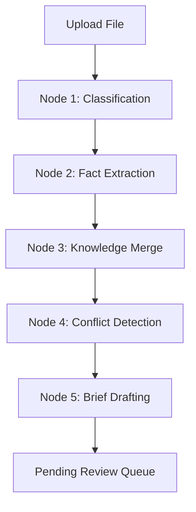

# LiveBrief - Project Intelligence Agent

LiveBrief is an agentic document intelligence system that reconciles disparate software engineering documents (PRDs, meeting notes, architecture designs, ADRs) into a unified, living **Project Brief** source of truth. 

The application utilizes **local open-source sentence embeddings**, a **PostgreSQL Vector Database (pgvector)**, and **large language models (LLMs)** to automatically categorize documents, extract key structured entities (features, decisions, timelines), highlight structural contradictions, and recommend versioned brief updates for human approval.

---

## 🏗️ System Architecture & Modular Layout

The backend codebase is refactored into a clean, modular structure following enterprise separation of concerns:

```text
backend/app/
├── core/
│   ├── config.py             # App configurations (ports, local path, API URLs, model parameters)
│   └── database.py           # Async engine setup & session maker (SQLAlchemy asyncpg)
├── models/
│   ├── __init__.py           # Exposes database models
│   └── models.py             # Database models mapping tables (Workspace, Document, Entity, etc.)
├── schemas/
│   ├── __init__.py           # Exposes validation schemas
│   └── schemas.py            # Pydantic input/output schemas for API validations
├── services/
│   ├── __init__.py           # Exposes public service APIs
│   ├── agent_service.py      # Node-based pipeline agent workflow (Classification -> Drafting)
│   ├── embedding_service.py  # Local Hugging Face all-MiniLM-L6-v2 embedder (384-dimension vectors)
│   ├── export_service.py     # PDF & DOCX generator from project brief sections
│   └── parser_service.py     # Document text extraction (.md, .pdf, .docx) & contextual chunker
└── routers/
    ├── __init__.py           # Mounts and registers all sub-routers
    ├── deps.py               # Shared API dependencies (e.g. get_active_workspace_id)
    ├── workspaces.py         # Workspace retrieval & template creation endpoints
    ├── documents.py          # Document upload & ingestion trigger endpoints
    ├── project_summary.py    # Summary brief sections retrieval & export endpoints
    ├── conflicts.py          # Conflict logs retrieval endpoints
    ├── reviews.py            # Recommended drafts approval/rejection endpoints
    ├── timeline.py           # activity logs & reverse timeline audit logs endpoints
    └── jobs.py               # Real-time pipeline status retrieval endpoints
```

---

## 🧬 Agentic Pipeline Workflow

When a file is uploaded, a background task triggers the agent pipeline runner ([agent_service.py](file:///c:/Projects/Python-projects/LiveBrief/backend/app/services/agent_service.py)). The pipeline transitions through 5 distinct nodes in a LangGraph-like state flow:



### Node 1: Classification
- **Action**: Extracts the first 3,000 characters of the document and asks the LLM to classify the document type.
- **Supported Classes**: `PRD`, `Architecture`, `Meeting Notes`, `ADR`, `Sprint Planning`, `Release Notes`, `API Specification`, or `Unknown`.
- **Database Action**: Saves the document classification type and confidence score to the `documents` table.

### Node 2: Information Extraction
- **Action**: Divides the document text into contextual paragraphs using the custom chunker. Chunks are batched into groups of 3 (to stay within free-tier API rate limits).
- **Extraction**: The LLM extracts key entities into 7 categories (`features`, `technical_decisions`, `components`, `risks`, `action_items`, `deadlines`, `owners`). For every extracted entity, a direct text sentence is saved in `source_excerpt`.
- **Embedding Generation**: Generates 384-dimension vectors locally using the Hugging Face `all-MiniLM-L6-v2` model for:
  - Each raw document text chunk.
  - Each extracted entity (by stringifying its JSON structure).
- **Database Action**: Persists chunks in the `embeddings` table and extracted facts in the `entities` table (both storing their vector representations in `pgvector` columns).

### Node 3: Knowledge Merge (Retrieval-Augmented Verification)
- **Action**: Compares the newly extracted entities against existing entities in the same workspace.
- **pgvector Retrieval**: Instead of looping through all database records, the agent queries PostgreSQL directly using pgvector's cosine distance operator:
  ```sql
  SELECT * FROM entities 
  WHERE type = :new_type AND document_id != :current_doc_id 
  ORDER BY embedding <=> :new_embedding
  LIMIT ...
  ```
- **Filter**: Keeps entity pairs where the cosine distance is $\le 0.60$ (equivalent to cosine similarity $\ge 0.40$).
- **Database Action**: Passes matching candidate pairs to the next node.

### Node 4: Conflict Detection
- **Action**: Feeds each matched candidate pair into the LLM. The auditor determines if they contain flat contradictions (e.g. conflicting sprint deadlines, opposing system designs, or different owners).
- **Database Action**: If a conflict is verified, the agent inserts a record into the `conflicts` table and marks the corresponding brief section (e.g. `Timeline`, `Architecture`) as affected.

### Node 5: Brief Drafting
- **Action**: Identifies which of the 8 standard brief sections are affected. For each affected section, the agent fetches **all active workspace entities** matching that category from the database.
- **Drafting**: The LLM technical writer merges existing content with the new database entities to generate a clean, consolidated Markdown draft.
- **Database Action**: Creates a row in the `reviews` table containing the `old_value`, `new_value`, and the target section, keeping it in `pending` status until human approval.

---

## 🗄️ Database Entity-Relationship Diagram

The application uses PostgreSQL with the `vector` extension enabled.

```mermaid
erDiagram
    Workspace ||--o{ Document : contains
    Workspace ||--o{ ProjectSummary : has
    Workspace ||--o{ Conflict : has
    Workspace ||--o{ Review : has
    Workspace ||--o{ Timeline : logs
    Workspace ||--o{ GraphRun : tracks
    Document ||--o{ Embedding : has
    Document ||--o{ Entity : contains
    
    Workspace {
        UUID id PK
        String name UNIQUE
        DateTime created_at
    }
    Document {
        UUID id PK
        UUID workspace_id FK
        String filename
        String storage_path
        String type
        Float classification_confidence
        String status
        Integer version
        DateTime uploaded_at
    }
    Embedding {
        UUID id PK
        UUID document_id FK
        Text chunk
        Integer chunk_index
        Vector embedding "pgvector(384)"
    }
    Entity {
        UUID id PK
        UUID document_id FK
        String type "feature | decision | component | etc."
        JSONB value
        Text source_excerpt
        Vector embedding "pgvector(384)"
        DateTime created_at
    }
    Conflict {
        UUID id PK
        UUID workspace_id FK
        String category
        Text description
        String severity
        UUID existing_entity_id FK
        UUID new_entity_id FK
        Boolean resolved
        DateTime created_at
    }
    ProjectSummary {
        UUID id PK
        UUID workspace_id FK
        String section "Overview | Architecture | Features | etc."
        Text content
        Integer version
        UUID last_review_id FK
        DateTime updated_at
    }
    Review {
        UUID id PK
        UUID workspace_id FK
        JSONB proposed_change "old_value, new_value, target_section"
        UUID conflict_id FK
        String status "pending | approved | rejected"
        Text reason "rejection reason"
        DateTime created_at
        DateTime resolved_at
    }
    Timeline {
        UUID id PK
        UUID workspace_id FK
        String event
        Text reason
        String actor
        UUID review_id FK
        String section
        DateTime timestamp
    }
    GraphRun {
        UUID id PK
        UUID workspace_id FK
        UUID document_id FK
        UUID batch_id
        String current_node
        String status "running | complete | failed"
        Text error
        DateTime started_at
        DateTime updated_at
    }
```

---

## 🛠️ Local Installation & Development

### 1. Database Setup
Ensure PostgreSQL is running and has the `pgvector` extension installed. If running inside Docker (standard setup):
```bash
# Pull and start Postgres 16 container with pgvector built-in
docker run --name postgres -e POSTGRES_PASSWORD=1234 -e POSTGRES_USER=ammar -e POSTGRES_DB=livebrief -p 5432:5432 -d pgvector/pgvector:pg16
```

### 2. Backend Setup
Use Python 3.11+ and `uv` package manager for fast dependency installations:
```bash
# Install package dependencies and sync virtual env
uv sync

# Run database table initialization (creates extension and tables)
uv run python -m backend.app.init_db

# Start the FastAPI backend server
uv run uvicorn backend.app.main:app --reload --port 8000
```

### 3. Frontend Setup
Navigate to the frontend directory and start the Vite development server:
```bash
cd frontend
npm install
npm run dev
```

### 4. Running Tests
Run the unit and E2E mock pipeline test suite:
```bash
uv run python -m pytest
```
